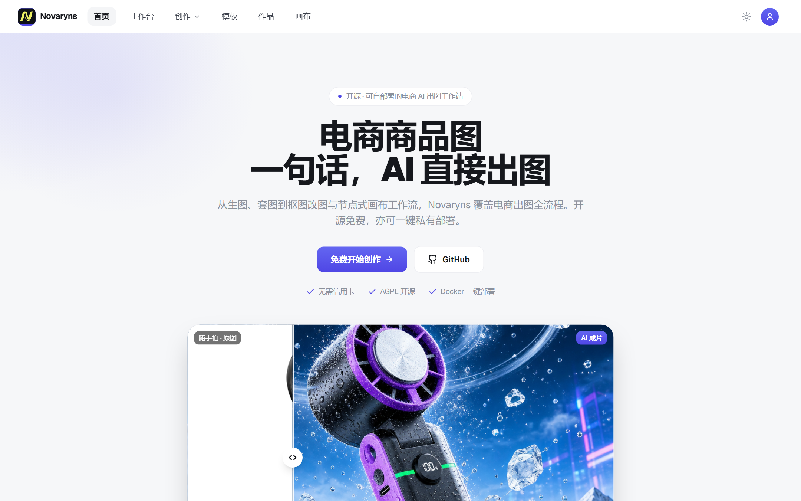
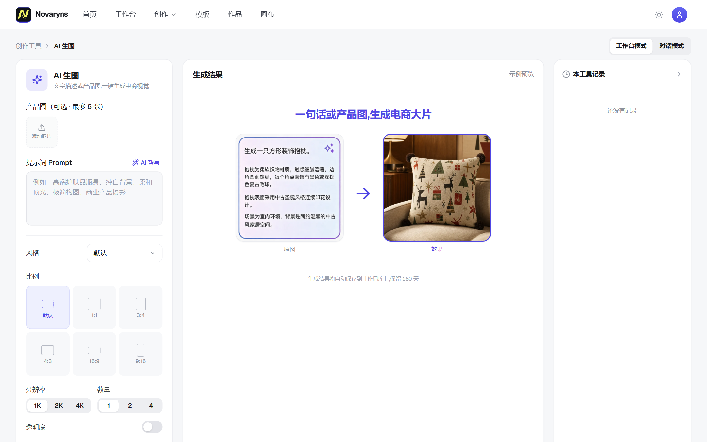
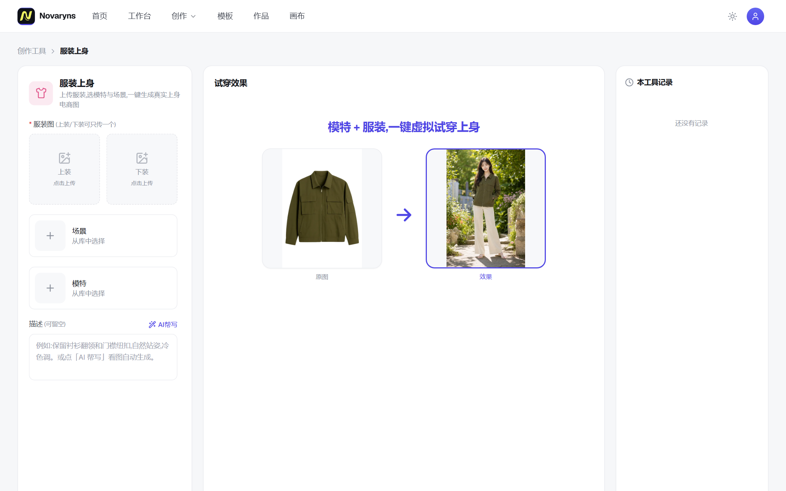
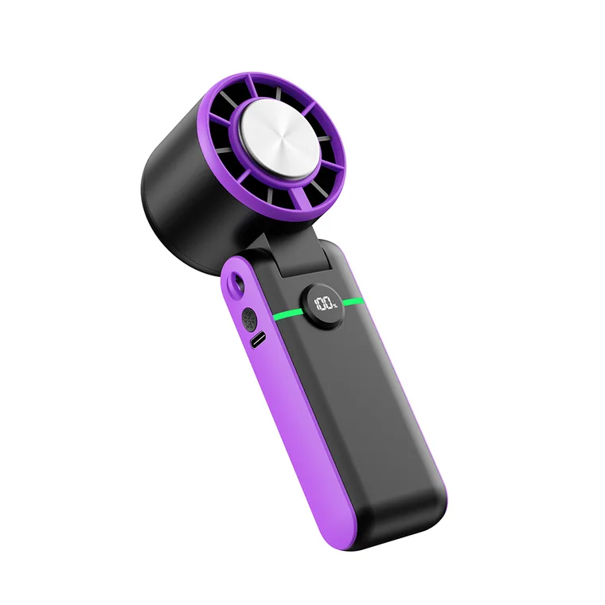
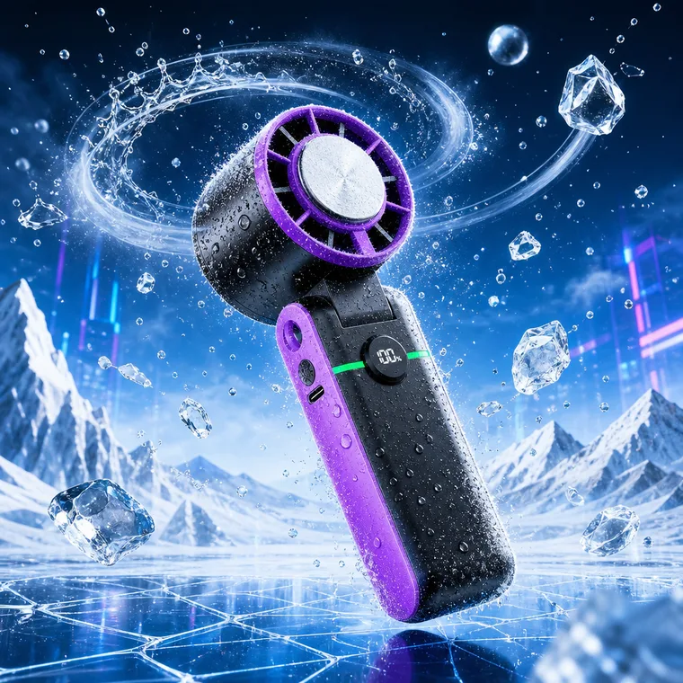
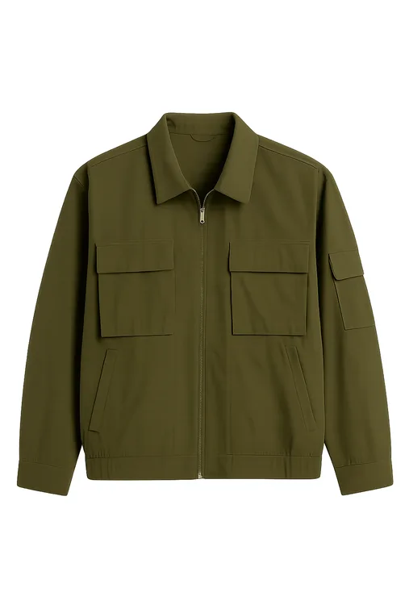
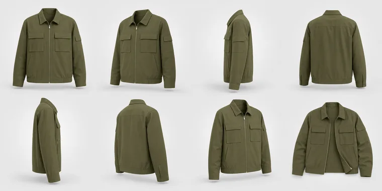

<div align="center">

# Novaryns

**开源 AI 电商生图网站 — 生图 / 套图 / 抠图 / 试穿 / 画布,一站式出商业级商品图**

Open-source AI e-commerce visual studio — generate, batch-suite, cut out, try on and canvas-compose production-ready product images.

[快速开始](#-快速开始--quick-start) · [功能](#-功能--features) · [版本](#-版本--editions) · [License](#-license)

</div>

---

## ✨ 功能 / Features

- **AI 生图** — 文生图 / 图生图,电商风格化提示词体系,1K/2K/4K
- **一键套图** — 上传产品图,自动产出 1 主图 + 4 副图 + 8 详情图整套素材
- **18 款图像工具** — 发丝级抠图、高清放大、局部改图、风格转换、服装平铺提取、3D 展示、虚拟试穿、去皱、去水印、印花提取、侵权检测、爆款标题……
- **创作画布** — React Flow 血缘画布,每张图的来源与迭代一目了然
- **对话生图** — 聊天式改图,一句话继续迭代
- **完整后台** — 模板库、提示词配置、API Key 管理(浏览器 RSA 加密 + AES 落库)
- **国际化** — 中 / 英双语,按浏览器语言自动切换

## 🖥 界面预览 / UI

<p align="center">
  
</p>
<table>
  <tr>
    <td align="center" width="50%">
      <br /><b>AI 生图工作台</b>
    </td>
    <td align="center" width="50%">
      <br /><b>服装上身(虚拟试穿)</b>
    </td>
  </tr>
</table>

## 📸 功能预览 / Screenshots

<table>
  <tr>
    <td colspan="2" align="center">
      <br />
      <b>AI 生图</b> — 一句话或产品图,生成电商大片
    </td>
  </tr>
  <tr>
    <td align="center" width="50%">
       ➜ <br />
      <b>一键套图</b> — 1 主图 + 4 副图 + 8 详情图
    </td>
    <td align="center" width="50%">
       ➜ <br />
      <b>服装上身</b> — 选模特与场景,一键虚拟试穿
    </td>
  </tr>
  <tr>
    <td align="center">
      <br />
      <b>AI 抠图</b> — 发丝级透明底
    </td>
    <td align="center">
       ➜ <br />
      <b>AI 变清晰</b> — 模糊图高清修复放大
    </td>
  </tr>
  <tr>
    <td align="center">
       ➜ <br />
      <b>3D 服装图</b> — 幽灵模特立体展示
    </td>
    <td align="center">
       ➜ <br />
      <b>图裂变</b> — 一张图裂变整组系列素材
    </td>
  </tr>
  <tr>
    <td align="center">
       ➜ <br />
      <b>AI 融图</b> — 多图元素无缝合成
    </td>
    <td align="center">
       ➜ <br />
      <b>局部改图</b> — 涂哪改哪,其余不动
    </td>
  </tr>
</table>

## 🚀 快速开始 / Quick start

### 🐳 第 0 步:安装 Docker(没装的话)

#### 🇨🇳 大陆服务器(推荐,稳定)—— 走阿里云源

> `get.docker.com` 是国外站,大陆访问它常被网络**间歇性重置**(时好时坏、报 `curl: (35) Connection reset`),不可靠。下面用阿里云内网源(`mirrors.aliyun.com`),秒装、稳定。

**Ubuntu / Debian:**
```bash
apt-get update && apt-get install -y ca-certificates curl gnupg
install -m 0755 -d /etc/apt/keyrings
curl -fsSL https://mirrors.aliyun.com/docker-ce/linux/ubuntu/gpg | gpg --dearmor -o /etc/apt/keyrings/docker.gpg
chmod a+r /etc/apt/keyrings/docker.gpg
echo "deb [arch=$(dpkg --print-architecture) signed-by=/etc/apt/keyrings/docker.gpg] https://mirrors.aliyun.com/docker-ce/linux/ubuntu $(. /etc/os-release && echo $VERSION_CODENAME) stable" > /etc/apt/sources.list.d/docker.list
apt-get update && apt-get install -y docker-ce docker-ce-cli containerd.io docker-compose-plugin
systemctl enable --now docker
```

**CentOS / Alibaba Cloud Linux:**
```bash
yum install -y yum-utils
yum-config-manager --add-repo https://mirrors.aliyun.com/docker-ce/linux/centos/docker-ce.repo
yum install -y docker-ce docker-ce-cli containerd.io docker-compose-plugin
systemctl enable --now docker
```

#### 🌎 海外服务器 —— 一条命令

```bash
curl -fsSL https://get.docker.com | bash && systemctl enable --now docker
```

装完用 `docker -v && docker compose version` 验证两个都有输出即可。

**部署注意事项:**
- **大陆服务器拉镜像慢/失败**:给 Docker 配镜像加速 —— `/etc/docker/daemon.json` 写入 `{"registry-mirrors":["https://docker.m.daocloud.io"]}` 后 `systemctl restart docker`。
- **防火墙/安全组**:放行 `80` 端口(HTTP)——阿里云/腾讯云在控制台「安全组」加一条 80 规则即可,浏览器直接 `http://公网IP` 打开。若 80 已被占用(装了宝塔/nginx),用 `HTTP_PORT=8080 docker compose up -d` 换个端口。
- **内存**:建议 ≥2GB;若镜像拉取失败触发本地构建,构建期需 ~2-4GB(小内存机器可先加 swap)。
- **大陆服务器连不上模型**:见下方「中国大陆服务器部署」配置 `OPENAI_BASE_URL` 中转。

### 🚀 第 1 步:安装网站程序

Docker 就绪后,**一条命令**装好(自动拉代码 + 拉预构建镜像 + 启动;大陆优先走国内镜像,秒级完成,无需本地编译):

```bash
curl -fsSL https://raw.githubusercontent.com/usscottli-ctrl/novaryns/main/install.sh | bash
```

> 若这条因网络取不到脚本,改用 git 拉下来再跑**同一个脚本**:
> ```bash
> git clone https://github.com/usscottli-ctrl/novaryns && cd novaryns && bash install.sh
> ```

打开 **http://<你的服务器公网IP>**(本机测试用 `http://localhost`) — 首启配置向导会引导你填入 OpenAI API Key(必填)、管理员密码(用于登录后台)、Pro License Key(选填)与站点名称,填完即用,**无需改任何代码或配置文件**。默认监听 **80 端口**,记得在云厂商安全组放行 80。

> 不知道 API Key 怎么获取?可联系作者微信 **xingze063**,或付费由作者代为提供 / 配置。

Compose 自带 Postgres 与持久化数据卷;生成的图片默认存本地磁盘(`/data/media`),配置 Cloudflare R2 后自动切对象存储。**改了源码想用自己的构建**:在项目目录跑 `docker compose up -d --build`。

### 🎛 已装宝塔面板(BT Panel)?

完全兼容,只是宝塔自带的 Nginx 通常占了 80 端口。**一键脚本会自动检测 80 是否被占用并改用 8080**,不会冲突。

宝塔用户推荐用面板接管域名与证书(最顺):
1. Docker 就绪(宝塔「软件商店」可一键装 Docker),按上面装好 Novaryns(会跑在 `8080`);
2. 宝塔「网站」→ 添加站点(绑你的域名)→ 站点设置 →「反向代理」→ 目标 URL 填 `http://127.0.0.1:8080`;
3. 站点设置 →「SSL」→ Let's Encrypt 一键申请证书。

之后用 `https://你的域名` 访问,宝塔自动管理续期。

### 🔒 绑定域名 + HTTPS(可选,推荐正式对外使用)

默认是 `http://IP`(80 端口,明文)。有域名的话,把域名的 A 记录指向服务器 IP,即可自动签发免费 HTTPS 证书:

```bash
# 1) 让 app 退到内部端口,把 80/443 让给反代
HTTP_PORT=8080 docker compose up -d
# 2) 一条命令起 Caddy 反代 + 自动 HTTPS(把 your-domain.com 换成你的域名)
docker run -d --name novaryns-caddy --restart always   --add-host host.docker.internal:host-gateway   -p 80:80 -p 443:443 -v caddy_data:/data   caddy:2 caddy reverse-proxy --from your-domain.com --to host.docker.internal:8080
```

之后用 `https://your-domain.com` 访问,证书自动签发与续期。

### 🇨🇳 中国大陆服务器部署

大陆服务器**无法直连** `api.openai.com`。设置环境变量 `OPENAI_BASE_URL` 指向任意 **OpenAI 兼容中转 / 网关**即可(自建海外中转或第三方中转服务均可),全部生成接口自动生效:

```bash
# docker-compose.yml 的 environment 或 .env 中:
OPENAI_BASE_URL=https://your-relay.example.com/v1
```

**自建海外中转(一条命令)**:有任意一台海外服务器即可。准备一个指向它的域名(没有域名可用免费的 `<服务器IP>.sslip.io`),在海外机上跑:

```bash
docker run -d --name openai-relay --restart always -p 80:80 -p 443:443 -v caddy_data:/data caddy:2 \
  caddy reverse-proxy --from relay.yourdomain.com --to https://api.openai.com --change-host-header
```

证书自动签发。然后大陆实例填 `OPENAI_BASE_URL=https://relay.yourdomain.com/v1`,全部生成功能即通。

没有海外服务器、不想折腾?两条现成路:**云端托管**(免部署,我们代管,大陆开箱即用)或联系作者微信 **xingze063** 付费代配。海外服务器部署无需此配置。

### 🌐 服务器推荐

**免备案(香港、美国)** — 海外机可直连模型,开箱即用:

👉 [雨云 RainYun](https://www.rainyun.com/MTE1OTc0Ng==_)

**需备案(中国大陆)** — 大陆访问快,搭配上面的中转方案使用:

👉 [阿里云](https://www.aliyun.com/minisite/goods?userCode=nzlr5f7z)

## 📦 版本 / Editions

| | 开源版 Community | Pro 自托管 | 云端托管 Cloud |
|---|---|---|---|
| 价格 | **¥0**(AGPL-3.0) | **¥1,999/年起** | **¥3,999/年起** |
| 全部生成与图像工具 | ✅ | ✅ | ✅ |
| 创作画布 / 对话生图 | ✅ | ✅ | ✅ |
| 自带 API Key · 单机自用 | ✅ | ✅ | 含算力积分 |
| 白标(自有品牌/去署名) | — | ✅ | ✅ |
| 多用户注册 / 团队 | — | ✅ | ✅ |
| 收银台(支付宝/微信直收) | — | ✅ | ✅ |
| 运营后台高阶(用户/发卡/流水) | — | ✅ | ✅ |
| 商业授权(可闭源自用) | AGPL 义务 | ✅ | ✅ |
| 部署 | 自部署 | 自部署 + License Key | **免运维,专属实例 + 自有域名** |

购买 Pro 授权 / 开通云端托管:加作者微信 **xingze063**。

## 🧱 技术栈 / Stack

Next.js 14 (App Router) · TypeScript · Tailwind CSS · PostgreSQL · OpenAI Images API · Replicate(抠图/放大) · Cloudflare R2(可选)

## 📄 License

本项目以 **AGPL-3.0** 开源:你可以自由使用、修改、自部署;若基于本项目对外提供网络服务,须以同等许可开源你的修改。**不希望受 AGPL 约束的商业闭源使用,请购买 Pro 商业授权**(微信 xingze063)。

Licensed under **AGPL-3.0**. If you run a modified version as a network service you must open-source your modifications under the same license — or purchase a commercial Pro license instead.

---

<div align="center">
Made with ❤️ by the <b>Novaryns</b> team · WeChat <b>xingze063</b>
</div>
